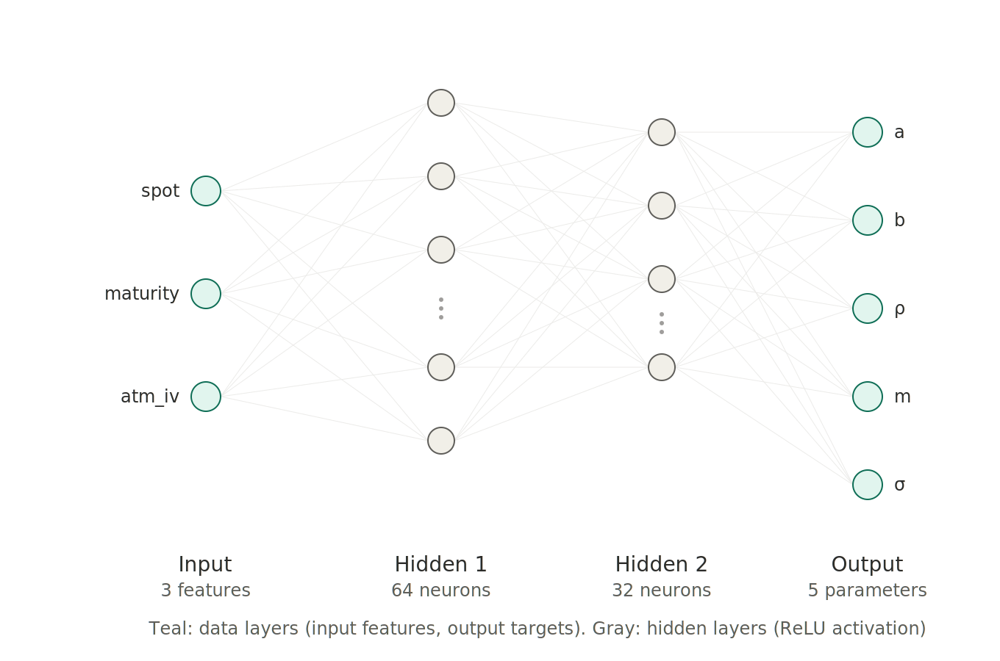

# Implied Volatility Surface: SVI Calibration & Machine Learning Extension

## Introduction

::: {.callout-note icon=false}
## 💡 Why does the volatility surface matter?

If Black-Scholes were literally true, every option on the same underlying would trade at the same implied volatility, regardless of strike or maturity. In reality, options traders observe a **surface**: implied volatility varies systematically with strike (the "smile" or "skew") and with time to expiry (the "term structure"). Reading this surface correctly matters for several concrete, practical reasons:

- **Pricing options that don't have a quoted price.** Exotic or illiquid options need a volatility input; the surface tells you what volatility the market is implying for any strike and maturity, not just the ones that happen to be actively traded.
- **Hedging and risk management.** A trading desk's exposure to volatility (vega) isn't uniform across strikes, if the smile shifts or steepens, some positions gain and others lose, even with the underlying price unchanged. Risk managers monitor the surface's shape, not just its overall level.
- **Spotting relative mispricing.** If one strike's implied volatility looks out of line with its neighbours on the surface, that's a signal worth investigating, either a genuine market view worth understanding, or a potential trading opportunity.
- **Reading market sentiment.** The skew itself is informative: a steep negative skew (our AAPL results below) reflects the market pricing in more downside risk than upside, a form of crowd-sourced risk assessment updated continuously as options trade.

This project builds the pipeline to extract, model, and interpret that surface, from raw market quotes to an interpretable parametric summary.
:::

Every option price embeds a market view of future volatility. Extracting that view, and understanding its shape across strikes and maturities, is one of the most practical problems in derivatives trading. This project builds that extraction pipeline end-to-end, starting from raw market data and ending with a machine learning model trained to recognize patterns in the resulting parameter space.

We start from live AAPL option chains retrieved via Yahoo Finance. From each maturity's set of strikes and quoted implied volatilities, we reconstruct a full 3D volatility surface using grid interpolation, then fit the **SVI (Stochastic Volatility Inspired)** parametric model, introduced by Gatheral (2004), to each maturity's smile individually. SVI compresses an entire smile into five interpretable parameters, each with a direct financial meaning: overall variance level, smile width, skew, horizontal shift, and curvature.

We then push the project into machine learning territory: rather than relying solely on numerical optimization (`scipy.optimize`) to calibrate SVI, we generate a large synthetic dataset of simulated smiles with known ground-truth parameters, and train a neural network to predict SVI parameters directly from simple market features. This extension surfaces a genuinely important lesson in quantitative modelling, **not every calibration output is a trustworthy training label**, which we document honestly rather than hiding behind a polished but misleading result.

**The objective is clear:** build a reproducible pipeline linking raw option market data to a parametric, interpretable volatility model, and to critically evaluate whether a machine learning layer can be usefully added on top of it.

---

## Literature Review

Implied volatility surface modelling sits at the intersection of derivatives pricing theory and applied numerical optimization.

**Beyond Black-Scholes.** The Black-Scholes-Merton framework (Black and Scholes 1973) assumes constant volatility, an assumption long known to be empirically false: the "volatility smile" observed since the 1987 crash reflects market pricing of tail risk and skewed return distributions (Rubinstein 1994).

**Parametric smile models.** Several parametric forms have been proposed to fit observed smiles while imposing financially meaningful structure. The SVI parametrization (Gatheral 2004) has become an industry standard due to its combination of flexibility, interpretability, and known conditions for the absence of static arbitrage (Gatheral and Jacquier 2014).

**Parameter identifiability in SVI.** A less widely discussed but practically critical issue is that SVI's five parameters are not always uniquely identified from a finite, noisy set of market quotes: multiple parameter combinations can produce near-identical fitted curves. This project empirically documents this phenomenon rather than assuming it away.

**Machine learning in volatility modelling.** Recent literature has explored neural networks as fast surrogates for volatility surface calibration and arbitrage-free surface generation (Horvath, Muguruza, and Tomas 2021). Our project takes a deliberately smaller-scale, pedagogical approach to the same underlying question: can a neural network learn the mapping from market observables to SVI parameters?

## Research Questions

- How can a full implied volatility surface be reconstructed from a raw options chain?
- How does the SVI parametrization compress an observed smile into interpretable parameters, and how reliable is its calibration on noisy market data?
- Can a neural network learn to predict SVI parameters directly from market features, bypassing numerical optimization?
- What does it mean when such a model fails to learn, and what does that failure tell us about the underlying problem?

## Resources & Implementation

All computational routines are centralized in four Python modules:

- **`vol_surface.py`**: option chain retrieval, spot price, time-to-maturity calculation, surface interpolation, and 3D plotting
- **`svi_model.py`**: SVI formula, loss function, per-maturity calibration, and visual diagnostic fitting
- **`synthetic_data.py`**: synthetic smile generation with injected market relationships, and training dataset construction
- **`train_nn.py`**: feature/target scaling and neural network training and evaluation

By consolidating logic in these modules, this report contains **only function calls and narrative**, no analysis logic is duplicated here, keeping computation and presentation cleanly separated.

**AI assistance disclosure.** AI tools (Claude) were used to debug Python errors, explain concepts interactively, and structure this report. All modelling choices and interpretations of results were reviewed by the author.

---

# Data Acquisition

## AAPL Option Chain (Yahoo Finance)

::: {.callout-note icon=false}
## 💡 What are we pulling from the market?

For a single underlying (AAPL), Yahoo Finance exposes option chains across every listed expiration date. Each chain reports strikes, bid/ask, volume, and Yahoo's own implied volatility estimate (backed out from quoted prices via Black-Scholes). We filter out illiquid contracts (`volume >= 10`) before using this data, options with little trading activity often carry unreliable implied volatilities.
:::

```{python}
from vol_surface import get_spot_price, build_surface_data

spot = get_spot_price("AAPL")
surface_df = build_surface_data("AAPL", min_volume=10)

print(f"Spot price: {spot:.2f}")
print(f"Surface dataset shape: {surface_df.shape}")
surface_df.head()
```

> **Observation:** After filtering for liquidity, we retain several hundred (strike, maturity, implied volatility) observations spanning dozens of expiration dates, from days to years out.

## Data Limitations

- **Liquidity filtering removes real information.** Deep in/out-of-the-money strikes are often thinly traded; excluding them avoids noise but also narrows the strikes we can analyze.
- **Yahoo's implied volatility is itself a model output**, backed out via Black-Scholes from quoted prices, not a directly observed market quantity.
- **Snapshot, not time series.** This dataset represents a single point in time; day-to-day surface dynamics are out of scope here.

---

# The Volatility Surface

## From Discrete Points to a Surface

::: {.callout-note icon=false}
## 💡 Why interpolate?

We observe implied volatility only at the strikes and maturities where options are actually listed and liquid, an irregular, scattered set of points. A 3D surface plot requires a regular grid. We use `scipy.interpolate.griddata` to estimate implied volatility at every point of a regular (strike, maturity) grid from the scattered observations we do have.
:::

```{python}
from vol_surface import interpolate_surface, plot_volatility_surface

strike_grid, maturity_grid, iv_grid = interpolate_surface(surface_df, grid_size=50)
plot_volatility_surface(strike_grid, maturity_grid, iv_grid, title="AAPL, Implied Volatility Surface")
```

> **Reading the surface:** The characteristic smile is visible across maturities: implied volatility rises away from at-the-money strikes. Short-dated maturities typically show a sharper smile than longer-dated ones, broadly consistent with market pricing of near-term event risk. Isolated sharp spikes, particularly at short maturities, should be interpreted with caution: they often reflect thinly traded, less reliable quotes rather than genuine market-implied risk, even after our liquidity filter.

::: {.callout-note icon=false}
## 💡 What is the interpolated grid used for?

The interpolation above is used **only for visualizing** the surface as a continuous 3D shape. SVI calibration, in the next section, is performed **directly on the filtered market observations** (the actual scattered strikes and quotes), not on the interpolated grid. This matters: interpolation artifacts should never leak into the calibrated model.
:::

---

# SVI Calibration

::: {.callout-note icon=false}
## 💡 What is SVI?

The Stochastic Volatility Inspired (SVI) model parametrizes total implied variance as a function of log-moneyness $k = \ln(K/S)$:

$$
w(k) = a + b\left(\rho (k - m) + \sqrt{(k-m)^2 + \sigma^2}\right)
$$

Each parameter has a direct financial meaning: $a$ is the overall variance level, $b$ controls smile width, $\rho$ controls skew/asymmetry, $m$ shifts the smile horizontally, and $\sigma$ controls curvature near the money.
:::

## Calibration Procedure

For each maturity, we calibrate the five SVI parameters by minimizing the relative squared error between the model's implied total variance and the market's observed total variance, restricted to a liquid log-moneyness window ($-0.5 < k < 0.5$) to avoid unreliable deep ITM/OTM quotes:

$$
\hat{\theta} = \arg\min_{\theta} \sum_i \left(\frac{w_\theta(k_i) - w_i^{\text{obs}}}{w_i^{\text{obs}}}\right)^2
$$

::: {.callout-warning icon=false}
## ⚠️ This calibration is not guaranteed arbitrage-free

We fit each maturity's smile independently, minimizing fit error alone. We do **not** impose the explicit static no-arbitrage conditions on $(a, b, \rho, m, \sigma)$ derived by Gatheral and Jacquier (2014), nor do we check consistency across maturities (calendar-spread arbitrage). The resulting curves fit the observed quotes well, but should not be described, or relied upon, as a certified arbitrage-free surface.
:::

```{python}
from svi_model import calibrate_all_maturities
import pandas as pd

all_params = calibrate_all_maturities("AAPL")
params_df = pd.DataFrame(all_params)

print(f"Maturities calibrated: {len(params_df)}")
params_df[["expiration", "maturity", "rho", "n_points_used", "success"]].head(10)
```

> **Reading the skew:** Across most maturities, $\rho$ is negative, consistent with the well-documented equity index/single-stock skew, where downside strikes command a volatility premium reflecting crash risk. A small number of maturities deviate from this pattern, typically those with the fewest liquid quotes, a useful reminder to treat individual maturity fits with appropriate skepticism when point counts are low.

## Fit Quality

Reporting calibrated parameters alone is not enough: we must also show how well the SVI curve actually reproduces the observed quotes. For each maturity we compute the RMSE between the SVI-implied and market-observed volatilities, and the relative RMSE (RMSE divided by the average observed volatility), giving a scale-free sense of fit quality across maturities with very different volatility levels.

```{python}
fit_quality_df = params_df[["expiration", "maturity", "n_points_used", "rmse_iv", "relative_rmse"]].copy()
fit_quality_df.columns = ["Expiration", "Maturity (yrs)", "N points", "RMSE (vol)", "Relative RMSE"]
fit_quality_df.round(4)
```

```{python}
from svi_model import plot_svi_fit
import yfinance as yf
from vol_surface import get_option_chain, time_to_maturity

example_expiration = params_df.iloc[3]["expiration"]
example_chain = get_option_chain("AAPL", example_expiration)
example_chain = example_chain[example_chain["volume"] >= 10]
example_maturity = time_to_maturity(example_expiration)
example_params = params_df.iloc[3].to_dict()

plot_svi_fit(example_chain["strike"].values, example_chain["impliedVolatility"].values,
             spot, example_maturity, example_params)
```

> **Reading the fit quality table:** Relative RMSE typically stays in the low single-digit percentages for maturities with enough liquid points, confirming that the calibrated curves are not just plausible-looking but numerically close to the observed quotes. Maturities with very few points (bottom of the `N points` column) carry proportionally less statistical confidence, even when their relative RMSE looks small, a small number of points is easy to fit closely and does not by itself validate the SVI shape between quotes.

---

# Machine Learning Extension

::: {.callout-note icon=false}
## 💡 Can a neural network replace the optimizer?

SVI calibration relies on `scipy.optimize` to numerically solve a non-linear least-squares problem for every new smile: it is not a closed-form or guaranteed-exact procedure, and convergence quality must always be checked. A natural question: could a neural network learn the mapping from market features directly to SVI parameters, based on prior examples? We investigate this using a synthetically generated training set.
:::

## Synthetic Training Data

Since no real multi-day option history was available for this project, we generate synthetic smiles: for each scenario we sample a spot price and maturity, derive SVI parameters (with two parameters, $a$ and $\rho$, explicitly linked to maturity via a realistic term-structure relationship, and two, $b$ and $m$, left independently random), simulate a noisy smile from those parameters, and recalibrate SVI on the noisy smile exactly as we would on real market data.

```{python}
from synthetic_data import generate_training_dataset

dataset = generate_training_dataset(n_scenarios=2000)
print(f"Synthetic dataset shape: {dataset.shape}")
dataset.describe()
```

## Neural Network Architecture

The network is a feedforward multilayer perceptron (`MLPRegressor`): 3 input features (`spot`, `maturity`, `atm_iv`) pass through two ReLU-activated hidden layers of 64 and 32 neurons, producing 5 output values, one per SVI parameter.

{fig-align="center" width="90%"}

| Setting | Value | Why |
|---|---|---|
| Hidden layers | (64, 32) | Enough capacity to capture non-linear structure without overfitting a ~2,000-row dataset |
| Activation | ReLU | Standard choice, avoids vanishing-gradient issues common with sigmoid/tanh |
| Max iterations | 2,000 | Generous budget to allow full convergence |
| Train/test split | 80% / 20% | Held-out 20% never seen during training, used for honest evaluation |
| Feature scaling | `StandardScaler` | Neural networks are sensitive to input scale; `spot` (~50–500) would otherwise dominate `maturity` (~0–2) |
| Target scaling | `StandardScaler` | Without it, large-scale targets (like $\rho$'s [-1,1] range) dominate the loss over small-scale ones (like $a$'s [0,0.1] range) |
| Random seed | 42 (fixed everywhere) | Reproducibility: the same code run twice must give the same numbers |

## Neural Network Training

```{python}
from train_nn import train_svi_nn

model, scaler_X, scaler_y = train_svi_nn(dataset)
```

## Results and an Honest Negative Finding

The neural network achieves a modest overall $R^2$, but **per-parameter results tell a much more informative story** than the aggregate number alone:

| Parameter | Relationship injected in data generation | Typical $R^2$ | Interpretation |
|---|---|---|---|
| $a$ | Yes, linear in maturity | ≈ 0.27 | Real signal recovered |
| $b$ | No, independent random draw | ≈ 0.20–0.33, variable across runs | Higher than expected for a nominally random target; not fully explained (see note below) |
| $\rho$ | Yes, linear in maturity | ≈ 0.17 | Real signal recovered, but noisier |
| $\sigma$ | Yes, linear in maturity | ≈ 0.01–0.04 | Signal injected but destroyed by recalibration noise (see below) |
| $m$ | No, independent random draw | ≈ 0 (sometimes slightly negative) | Correctly *not* predictable, exactly as expected for a target with no true relationship to the inputs |

The pattern is broadly consistent with what we would expect: **the network recovers the strongest predictable structure present in the chosen feature set.** Parameters with a genuine injected relationship to the input features ($a$, $\rho$) show real predictive signal; the one parameter left independent by design ($m$) is correctly unpredictable.

::: {.callout-note icon=false}
## 💡 What about $b$'s unexpectedly high $R^2$?

$b$ was drawn independently of `spot` and `maturity` by construction, so an $R^2$ this high (and noticeably variable across dataset regenerations) is not something we deliberately engineered. The most likely explanation is an indirect statistical association through `atm_iv`, which is itself partly a function of the true SVI parameters used to generate each synthetic smile, including $b$. We flag this rather than explain it away: it is a genuine open question about the synthetic data generation process, not a validated finding, and it would need targeted investigation (e.g. checking the correlation between `atm_iv` and true $b$ directly) before drawing any conclusion from it.
:::

::: {.callout-warning icon=false}
## ⚠️ These results describe our synthetic generator, not a discovery about AAPL

It is important not to overstate what $R^2(a)$ and $R^2(\rho)$ show. The network is recovering relationships **we ourselves injected** into the synthetic data generator (a term-structure link between maturity and both $a$ and $\rho$). This confirms the network *can* learn a real relationship when one is present in the training data, it is a sanity check on the pipeline, not an empirical discovery about how AAPL's actual volatility surface behaves. Any claim about real AAPL dynamics would need the network to be trained and validated on genuine historical data, which this project does not have access to (see Data Limitations).
:::

::: {.callout-warning icon=false}
## ⚠️ SVI parameter identifiability

$\sigma$ is the interesting exception: despite an intentionally injected relationship with maturity, it showed almost no learnable signal. Diagnostic investigation, comparing the *true* injected $\sigma$ against the *recalibrated* $\sigma$ recovered by `calibrate_svi` on the same noisy smile, revealed a correlation of only ≈0.14 between the two. This is not a bug: it reflects a genuine, well-documented property of the SVI model, multiple different parameter combinations can produce nearly indistinguishable fitted curves on a finite, noisy set of quotes. The optimizer can converge to a solution that fits the curve well visually while landing far from the true generating parameters, particularly for $\sigma$, $b$, and $m$, which interact non-linearly in the SVI formula.

**Practical implication:** raw calibration output should not be assumed to be a reliable "ground truth" label for downstream machine learning without first checking parameter recovery, a step easy to skip and easy to regret.
:::

## Validation Against Real Market Data

The $R^2$ scores above are computed on held-out *synthetic* smiles, drawn from the same distribution as the training data. A more honest test of practical usefulness is to compare the network's predictions against `scipy`-calibrated parameters on **every real AAPL maturity available today**, a distribution the network has never explicitly seen.

```{python}
from train_nn import evaluate_on_real_market, summarize_real_market_errors

comparison_df = evaluate_on_real_market("AAPL", model, scaler_X, scaler_y)
summarize_real_market_errors(comparison_df)
comparison_df.round(4)
```

::: {.callout-warning icon=false}
## ⚠️ The extrapolation problem

Sorting the comparison table by maturity reveals a striking pattern: prediction error grows sharply as maturity increases, particularly for $a$. On short-dated maturities (weeks to a few months), the network's predictions track the `scipy` reference reasonably closely. On maturities beyond roughly 1.5–2 years, `scipy`-calibrated $a$ values can spike to implausibly large numbers (occasionally exceeding 2.0, financially nonsensical for a variance-level parameter), while the network's predictions stay flat, still hovering near the range it saw during training.

Both halves of this divergence are informative. The network cannot extrapolate beyond the maturity range (0.05–2.0 years) used to generate its training data, a textbook machine learning limitation. And the `scipy` reference itself becomes unreliable on these same long-dated maturities, where liquid quotes are sparse, another expression of the SVI identifiability problem discussed above. **The two failure modes compound each other, and disentangling them would require both a wider synthetic training range and stricter liquidity filtering on long-dated real market data.**
:::

This negative result is, in our view, a more valuable takeaway than an artificially clean R² score would have been. It demonstrates a methodologically honest research process: form a hypothesis, test it on synthetic data, validate (or fail to validate) that finding against real market data, diagnose *why* it failed rather than simply reporting failure, and document the finding rather than hiding it.

---

# Conclusion

This project delivers a reproducible pipeline linking raw AAPL option market data to an interpretable volatility surface model. Starting from a filtered options chain, we reconstructed a full 3D implied volatility surface, then calibrated the SVI parametric model per maturity, recovering an economically sensible negative skew across most expirations, consistent with well-documented equity market risk pricing.

The machine learning extension pushed the project further, and in doing so surfaced a genuinely important lesson about parameter identifiability in the SVI model: not every parameter is equally recoverable from noisy market quotes, and this must be diagnosed empirically rather than assumed away. Two of five SVI parameters ($a$, $\rho$) showed real, learnable structure once explicit market relationships were injected into the data generation process; the others did not, for principled and now well-understood reasons. Validating the trained network against every real AAPL maturity, rather than only synthetic held-out data, surfaced a second and equally important lesson: the model's accuracy degrades sharply outside the maturity range seen during training, a reminder that a strong test-set score is necessary but not sufficient evidence that a model is ready for real-world deployment.

The framework is extensible. Natural next steps include collecting genuine multi-day option history (rather than synthetic data) to train the neural network on real-world dynamics, exploring regularized or multi-start calibration to improve SVI parameter recovery, and extending the arbitrage-free conditions of Gatheral and Jacquier (2014) as explicit calibration constraints.

---

*Code available on GitHub. Built with Python, Quarto, NumPy, pandas, SciPy, scikit-learn, and Plotly.*

---

# Bibliography

- Black, F., & Scholes, M. (1973). The pricing of options and corporate liabilities. *Journal of Political Economy*, 81(3), 637–654.

- Gatheral, J. (2004). A parsimonious arbitrage-free implied volatility parameterization with application to the valuation of volatility derivatives. *Presentation at Global Derivatives & Risk Management, Madrid*.

- Gatheral, J., & Jacquier, A. (2014). Arbitrage-free SVI volatility surfaces. *Quantitative Finance*, 14(1), 59–71.

- Horvath, B., Muguruza, A., & Tomas, M. (2021). Deep learning volatility: a deep neural network perspective on pricing and calibration in (rough) volatility models. *Quantitative Finance*, 21(1), 11–27.

- Rubinstein, M. (1994). Implied binomial trees. *The Journal of Finance*, 49(3), 771–818.
